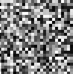
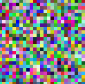

# Visual noise

## Description
Small program that generate white and "colorful" noise.

## Requirements
[Processing](https://processing.org) is required.

## Quick start
1. Open Processing IDE.
2. Open `random.pde`.
3. Run the game.
